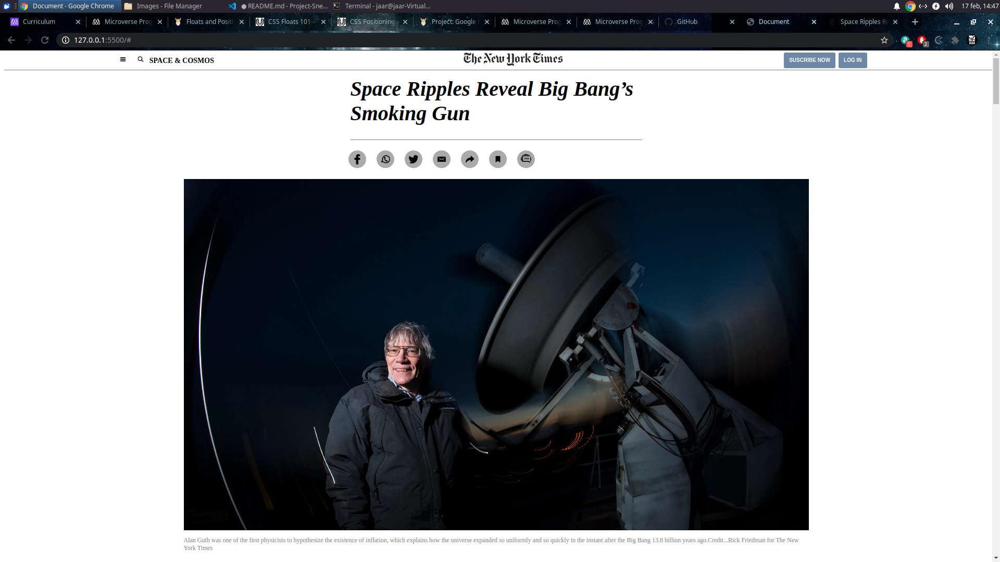

# Project Sneak Peak

> This project is a clone of a New York Times article.

The page was build using the information provided by the program like flow, float, position and grid.

## Built With

- HTML
- CSS

## Live Demo

https://jaarkira.github.io/Project-Sneak-Peaks/

## Authors

👤 **JAAR**

- GitHub: [@jaarkira](https://github.com/jaarkira)
- Twitter: [@jaar_91](https://twitter.com/91_jaar)
- LinkedIn: [LinkedIn](https://linkedin.com/linkedinhandle)

## 🤝 Contributing

Contributions, issues, and feature requests are welcome!

Feel free to check the [https://github.com/jaarkira/Project-Sneak-Peaks/issues](issues/).

## Show your support

Give a ⭐️ if you like this project!

## Acknowledgments

- Hat tip to anyone whose code was used
- Inspiration
- etc